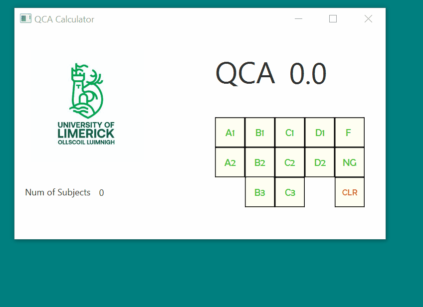

# UL_QCA_Calculator
A calculator for the University of Limerick's QCA system

  

## Instructions

Double click the jar file to run the application. QCA is calculated after each grade is inputted    

## Built With

* [Java FX](https://en.wikipedia.org/wiki/JavaFX) - The gui used  

## Acknowledgments

* Scene builder was used for this project    
 
